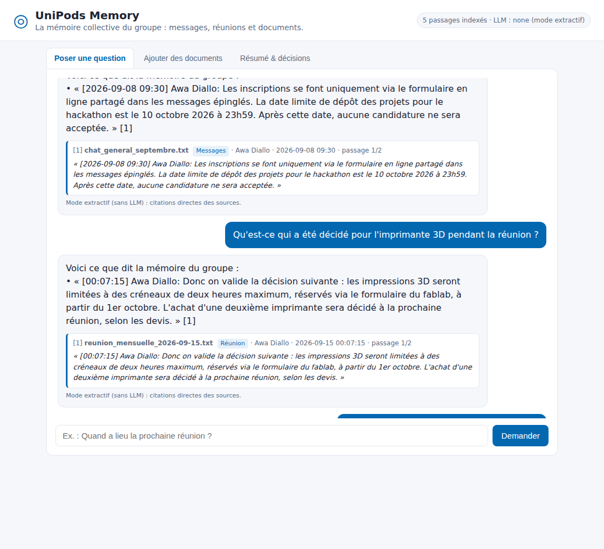
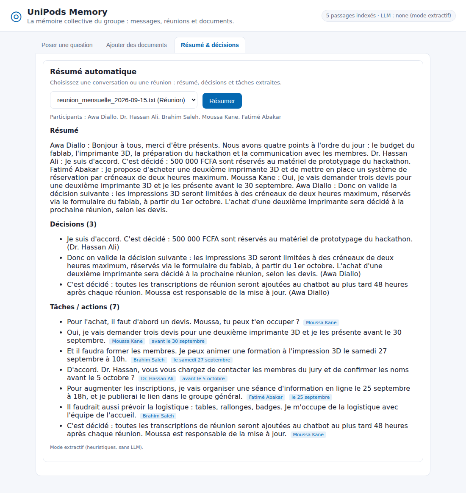

# UniPods Memory — chatbot de mémoire collective

Dans un grand groupe (400+ membres), on rate des messages, on repose des questions déjà répondues,
on manque des réunions. **UniPods Memory** indexe les **messages du groupe**, les **transcriptions de réunions**
et les **documents**, puis répond directement aux questions **en citant la source exacte**
(fichier, auteur, date, horodatage, extrait). Si l'information n'existe pas, il le dit — **sans inventer**.



## Fonctionnalités

| | Fonctionnalité | État |
|---|---|---|
| ✅ | Ingestion `.txt` / `.md` / `.pdf` (API multipart, API texte JSON, CLI, interface web) | fait |
| ✅ | Détection auto du type : chat (format `[AAAA-MM-JJ HH:MM] Nom: …` ou export WhatsApp), transcription (`[HH:MM:SS] Nom: …`), document | fait |
| ✅ | Chunks de 300–500 mots, équilibrés (à un message près, car on ne coupe jamais un message ou une intervention) ; métadonnées source, date(s), auteur(s), type, titre | fait |
| ✅ | Embeddings locaux gratuits (ONNX all-MiniLM-L6-v2 via ChromaDB) + base vectorielle ChromaDB persistante | fait |
| ✅ | Q/R RAG : recherche hybride (vectorielle + lexicale pondérée IDF), citations avec auteur/date/heure exacts | fait |
| ✅ | Garde-fou anti-hallucination : seuil de pertinence + réponse « information non disponible » | fait |
| ✅ | Génération par LLM **optionnelle** (Anthropic, OpenAI ou compatible, Ollama local) ; sinon mode extractif | fait |
| ✅ | Interface web (Q/R, ajout/suppression de documents, résumé) | fait |
| ✅ | **Bonus** : résumé d'une conversation/réunion + décisions + tâches (responsable, échéance) | fait |
| 🟡 | **Bonus** : bot Telegram (long polling) — logique testée, pas testé contre un vrai bot (pas de token) | fait, à valider |

## Architecture

```
/backend
  app/
    main.py          API FastAPI + service du frontend
    config.py        paramètres (.env)
    parsers.py       lecture txt/md/pdf, détection chat/transcription/document, en-têtes (Titre, Date, Auteur…)
    chunker.py       découpage 300–500 mots
    store.py         ChromaDB (persistant) + fonction d'embedding
    rag.py           recherche hybride, seuil de pertinence, réponse citée (LLM ou extractive)
    llm.py           client LLM optionnel (httpx, sans SDK)
    insights.py      bonus : résumé, décisions, tâches
    textutils.py     mots-clés, racinisation FR, IDF, découpage en phrases
    telegram_bot.py  bot Telegram optionnel
  scripts/ingest_folder.py   indexation d'un dossier en ligne de commande
  tests/             21 tests pytest (parsing, chunking, API, PDF, anti-hallucination, LLM simulé, bot)
/data
  samples/           jeu de démo : chat du groupe, transcription de réunion, guide du fablab
  chroma/            base vectorielle (générée, ignorée par git)
  uploads/           copies des fichiers envoyés via l'API (ignorées par git)
/frontend            index.html + app.js + style.css (vanilla, servi par FastAPI)
```

**Pipeline** : fichier → extraction texte → unités (message / intervention / paragraphe) avec auteur et date →
chunks de 300–500 mots → embeddings → ChromaDB.
**Question** → 20 candidats par similarité cosinus → re-classement hybride
`0,55 × similarité + 0,45 × recouvrement lexical pondéré IDF` → filtre de pertinence →
sélection des phrases les plus pertinentes → réponse (LLM contraint aux extraits numérotés, ou extraits cités tels quels).

## Installation

Prérequis : Python 3.10+ (testé en 3.11).

```bash
git clone <ce dépôt> && cd unipod-memory
python -m venv .venv
source .venv/bin/activate            # Windows : .venv\Scripts\activate
pip install -r requirements.txt
cp .env.example .env                 # facultatif : aucune clé n'est obligatoire
```

Au premier lancement, ChromaDB télécharge une seule fois le modèle d'embedding ONNX (~80 Mo) dans `~/.cache/chroma`.

## Lancement

```bash
# 1. Indexer le jeu de démo (ou vos propres fichiers)
python -m backend.scripts.ingest_folder --reset

# 2. Démarrer l'API + l'interface web
uvicorn backend.app.main:app --reload --port 8000
```

- Interface : http://localhost:8000
- Documentation interactive de l'API (Swagger) : http://localhost:8000/docs

Tests : `python -m pytest backend/tests -q`

### Déployer sur Vercel

Le dépôt est prêt pour Vercel (préréglage **FastAPI**, répertoire racine `./`) :
`pyproject.toml` déclare le point d'entrée (`[tool.vercel] entrypoint = "backend.app.main:app"`) et les dépendances.
⚠️ Vercel lit `pyproject.toml` et **ignore `requirements.txt`** : garder les deux listes synchronisées.

Quand la variable `VERCEL` est présente, l'application s'adapte automatiquement :
- base ChromaDB, fichiers envoyés et modèle d'embedding stockés dans `/tmp/unipods` (seul dossier inscriptible) ;
- le jeu de démo `data/samples` est **indexé automatiquement** à chaque démarrage à froid (`AUTO_SEED=1`).

Limites à connaître (hébergement serverless) :
- **stockage temporaire** : un document ajouté via l'interface peut disparaître au redémarrage d'une instance,
  et deux instances ne partagent pas la même base. Pour une mémoire durable, ajoutez les fichiers dans
  `data/samples/` et redéployez, ou hébergez le backend sur un service avec disque persistant (Render, Railway, Fly.io…) ;
- **premier appel lent** (démarrage à froid) : installation des dépendances restantes + téléchargement du modèle (~80 Mo) + indexation ;
- les clés LLM éventuelles se déclarent dans *Settings → Environment Variables* du projet Vercel.

### Activer un LLM (optionnel)

Sans LLM, le bot répond en **mode extractif** : il cite mot pour mot les messages/phrases pertinents.
Avec un LLM, il rédige une réponse synthétique, toujours contrainte aux extraits et avec références `[1]`, `[2]`.
Dans `.env` :

```bash
# Anthropic
ANTHROPIC_API_KEY=sk-ant-...          # LLM_MODEL par défaut : claude-sonnet-5
# ou OpenAI / tout serveur compatible (Groq, Mistral, OpenRouter…)
OPENAI_API_KEY=sk-...  LLM_BASE_URL=https://api.groq.com/openai/v1  LLM_MODEL=llama-3.1-8b-instant
# ou 100 % local et gratuit avec Ollama
LLM_PROVIDER=ollama  LLM_MODEL=llama3.1
```

Si l'appel au LLM échoue (quota, réseau), l'API bascule automatiquement en mode extractif et renvoie un `warning`.

### Bot Telegram (optionnel)

1. Créer un bot avec @BotFather, mettre `TELEGRAM_BOT_TOKEN=...` dans `.env`.
2. L'API doit tourner, puis : `python -m backend.app.telegram_bot`
3. Dans Telegram : poser une question, `/documents`, `/resume reunion_mensuelle_2026-09-15.txt`.

## Ajouter de nouveaux documents

Trois façons (un fichier portant le même nom **remplace** l'ancienne version, pas de doublons) :

1. **Interface web** → onglet « Ajouter des documents » (type, auteur et date optionnels).
2. **API** :
   ```bash
   curl -X POST localhost:8000/api/ingest \
        -F "files=@export_whatsapp.txt" -F "files=@compte_rendu.pdf" \
        -F "doc_type=auto" -F "date=2026-09-20"
   # texte brut (ex. depuis un autre bot) :
   curl -X POST localhost:8000/api/ingest/text -H 'Content-Type: application/json' \
        -d '{"source":"annonce.txt","text":"...","author":"Awa","date":"2026-09-20"}'
   ```
3. **Ligne de commande** : déposer les fichiers dans un dossier puis
   `python -m backend.scripts.ingest_folder data/mon_dossier [--type chat] [--author ...] [--date ...]`.

**Formats conseillés**
- Chat : `[2026-09-08 09:12] Awa Diallo: message` ou export WhatsApp `08/09/2026 09:12 - Awa: message`
  (les lignes de continuation sont rattachées au message précédent).
- Transcription : en-tête optionnel `Titre : …` / `Date : 2026-09-15` / `Participants : …`, puis `[00:04:05] Nom: texte`.
- Document : en-tête optionnel `Titre :`, `Auteur :`, `Date :`, puis texte libre (paragraphes).
- PDF : texte extrait avec pypdf (les PDF scannés sans couche texte sont refusés avec un message clair).

Autres endpoints : `GET /api/documents`, `DELETE /api/documents/{source}`, `POST /api/summarize`
(`{"source": "..."}` ou `{"text": "..."}`), `GET /api/health`.

## Exemples de questions / réponses (testés, mode extractif sans LLM)

Sorties réelles de `POST /api/ask` sur le jeu de démo (aussi vérifiées par `backend/tests/test_api.py`).

**1. Question tirée des messages du groupe**
> **Q :** Quelle est la date limite de dépôt des projets pour le hackathon ?
>
> **R :** Voici ce que dit la mémoire du groupe :
> • « [2026-09-08 09:30] Awa Diallo: Les inscriptions se font uniquement via le formulaire en ligne partagé dans les messages épinglés. La date limite de dépôt des projets pour le hackathon est le 10 octobre 2026 à 23h59. Après cette date, aucune candidature ne sera acceptée. » [1]
>
> **Source [1]** : `chat_general_septembre.txt` · Messages · Awa Diallo · 2026-09-08 09:30 · passage 1/2

**2. Question sur une réunion manquée**
> **Q :** Qu'est-ce qui a été décidé pour l'imprimante 3D pendant la réunion ?
>
> **R :** Voici ce que dit la mémoire du groupe :
> • « [00:07:15] Awa Diallo: Donc on valide la décision suivante : les impressions 3D seront limitées à des créneaux de deux heures maximum, réservés via le formulaire du fablab, à partir du 1er octobre. L'achat d'une deuxième imprimante sera décidé à la prochaine réunion, selon les devis. » [1]
>
> **Source [1]** : `reunion_mensuelle_2026-09-15.txt` · Réunion · Awa Diallo · 2026-09-15 à 00:07:15 · passage 1/2

**3. Question sur un document**
> **Q :** Comment réserver une machine du fablab ?
>
> **R :** Voici ce que dit la mémoire du groupe :
> • « Pour réserver une machine ou un poste de travail du fablab, il faut remplir le formulaire de réservation en ligne au moins 48 heures à l'avance. » (Équipe de coordination UniPod, 2026-09-01) [1]
>
> **Source [1]** : `guide_fablab_unipod.md` · Document · Équipe de coordination UniPod · 2026-09-01 · passage 1/1

**4. Information absente → pas d'hallucination**
> **Q :** Quel est le salaire du directeur de l'UniPod ?
>
> **R :** Je n'ai pas trouvé cette information dans la mémoire du groupe (messages, transcriptions de réunions et documents indexés). Elle n'est donc pas disponible pour le moment : vous pouvez poser la question dans le groupe ou ajouter le document concerné. — `found: false`, aucune source.

Autres questions qui fonctionnent sur la démo : « Quels sont les prix du hackathon ? », « À quelle heure ouvre l'UniPod le samedi ? »,
« Combien de filament gratuit par mois ? », « Est-ce qu'on peut découper du PVC au laser ? », « Quand a lieu la prochaine réunion mensuelle ? »,
« Combien d'équipes sont inscrites ? ». Refusées à juste titre : « Qui a gagné la coupe du monde 2022 ? », « Qui est le président du Tchad ? ».

### Bonus : résumé de réunion

`POST /api/summarize {"source": "reunion_mensuelle_2026-09-15.txt"}` → résumé, **3 décisions**
(500 000 FCFA réservés au prototypage, créneaux d'impression 3D de 2 h, transcriptions ajoutées sous 48 h)
et **7 tâches** avec responsable et échéance (ex. *Moussa Kane — 3 devis d'imprimante 3D avant le 30 septembre* ;
*Dr. Hassan Ali — confirmer le jury avant le 5 octobre*).



## Réglages utiles (`.env`)

| Variable | Défaut | Rôle |
|---|---|---|
| `MIN_RELEVANCE` | `0.30` | score hybride minimal pour qu'un passage soit utilisé (plus haut = plus prudent) |
| `TOP_K` | `4` | nombre de passages envoyés au LLM |
| `CHUNK_MIN_WORDS` / `CHUNK_MAX_WORDS` | `300` / `500` | taille des chunks |
| `EMBEDDING_BACKEND` | `default` | `sentence-transformers` (ex. `paraphrase-multilingual-MiniLM-L12-v2`, meilleur en français) ou `openai` — **réindexer avec `--reset` après changement** |
| `CHROMA_DIR` | `data/chroma` | emplacement de la base |

## Bilan

**Ce qui fonctionne** (vérifié par 21 tests automatisés, des appels HTTP réels et un test navigateur de l'interface) :
ingestion txt/md/pdf avec métadonnées, découpage 300–500 mots, ChromaDB persistant, Q/R avec citations exactes
(auteur, date, heure, extrait), refus honnête quand l'information manque, interface web complète,
résumé + décisions + tâches, fonctionnement 100 % gratuit et hors ligne (hors téléchargement initial du modèle).

**Bonus / non fini**
- Chemin LLM (Anthropic / OpenAI / Ollama) : implémenté et testé avec un LLM simulé, **pas testé avec une vraie clé** dans cet environnement.
- Bot Telegram : logique testée via l'API, **pas testé avec un vrai token**.
- Les résumés sans LLM sont extractifs (phrases clés + motifs linguistiques) : utiles mais moins fluides qu'un résumé rédigé.
- Le modèle d'embedding par défaut est surtout anglophone ; la recherche hybride (lexicale FR + IDF) compense
  bien sur la démo, mais pour de gros corpus en français, préférer `sentence-transformers` multilingue.

**Prochaines étapes possibles**
- Connecteurs directs : export Telegram/WhatsApp automatique, Google Drive, transcription audio des réunions (Whisper local).
- Filtres dans les questions (« cette semaine », « d'après la réunion du 15 ») via les métadonnées de date/type.
- Authentification et espaces par groupe ; journal des questions sans réponse pour enrichir la FAQ.
- Évaluation continue (jeu de questions de référence) et réglage automatique du seuil de pertinence.
- Reranker cross-encoder multilingue et mémoire de conversation (questions de suivi).
